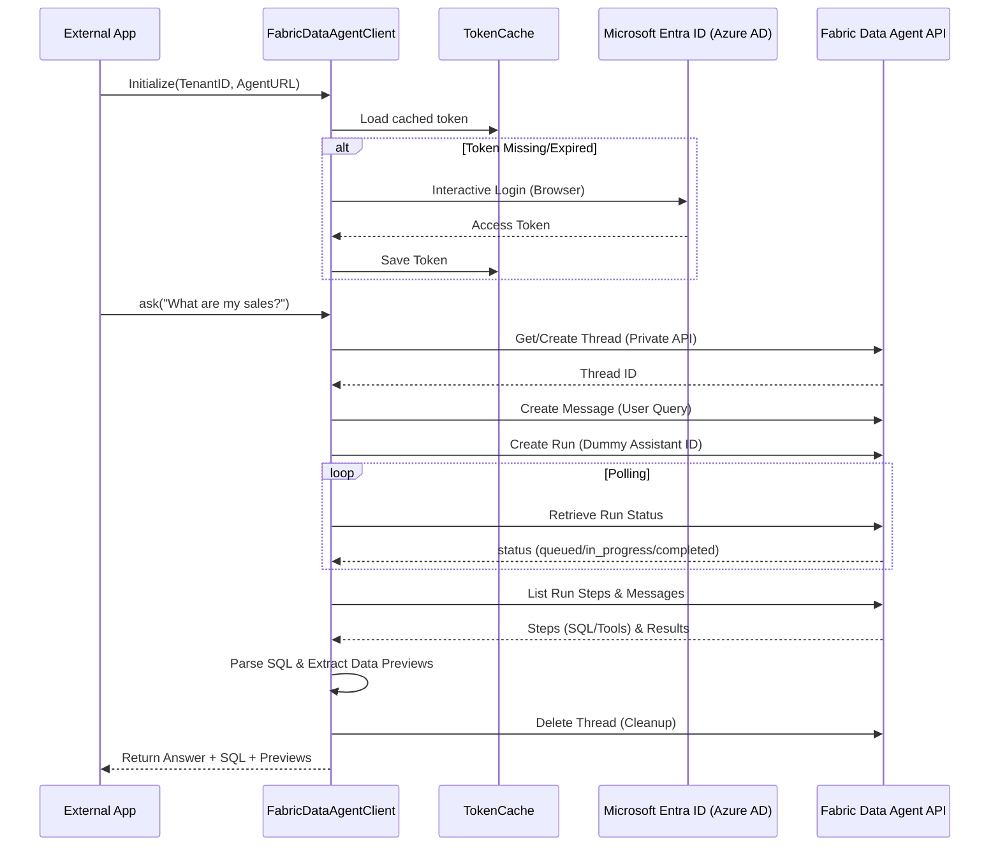

# Fabric Data Agent Client Execution Process

This document outlines the internal workflow and execution logic of the `FabricDataAgentClient`, which enables external Python applications to interact with Microsoft Fabric Data Agents.

## 1. Process Overview

The client bridges the gap between the OpenAI Assistants API interface (which Fabric mimics) and the specific requirements of the Fabric environment (Azure AD authentication and Workspace endpoints).

## 2. Detailed Execution Steps

### Phase 1: Authentication & Token Management
1.  **Cache Check**: The client checks for `.fabric_token_cache`. If a valid token exists, it skips login.
2.  **Interactive Login**: If needed, `azure-identity` opens a browser for standard corporate login.
3.  **Scoped Token**: It requests a token for `https://api.fabric.microsoft.com/.default`.

### Phase 2: Endpoint Configuration
The client configures the `OpenAI` SDK with:
-   `base_url`: The published Fabric Data Agent URL.
-   `default_query`: Specifies `api-version=2024-05-01-preview`.
-   `default_headers`: Includes the Bearer Token and a unique `ActivityId` for tracking.

### Phase 3: Fabric Thread Mapping
Unlike standard OpenAI threads, Fabric requires threads to be specifically mapped to workspaces. The client uses a "private" API endpoint:
-   `URL`: `.../__private/aiassistant/threads/fabric?tag="name"`
-   This ensures that the conversation history is correctly maintained within the Fabric context.

### Phase 4: The Run Lifecycle
1.  **Message**: The user's query is posted to the thread.
2.  **Run**: A run is initiated. Fabric ignores the `assistant_id` provided and uses the internal configuration of the published Data Agent.
3.  **Polling**: The client waits for completion. During this time, Fabric might be:
    -   Interpreting the natural language.
    -   Generating SQL queries.
    -   Executing queries against the Lakehouse.
    -   Summarizing the data.

### Phase 5: Result Parsing (`get_run_details`)
Once the run is `completed`, the client performs "deep inspection":
1.  **Steps Retrieval**: Fetches all operations performed during the run.
2.  **SQL Extraction**: Iterates through `tool_calls`. It looks for `lakehouse` tool outputs which contain the specific T-SQL generated by the agent.
3.  **Data Preview**: Captures the raw table output returned by the SQL engine.
4.  **Final Summary**: Retrieves the textual response intended for the user.

### Phase 3: Cleanup
To prevent thread accumulation, the client sends a `DELETE` request for the thread after the response is processed.

## 3. Core Class Structure

-   `TokenCache`: Manages local persistence of encrypted/temporary tokens.
-   `FabricDataAgentClient`: The main interface providing `ask()` and `get_run_details()`.
-   `_extract_sql_queries_with_data()`: The logic responsible for mining the "Run Steps" for technical transparency (SQL/Data).
